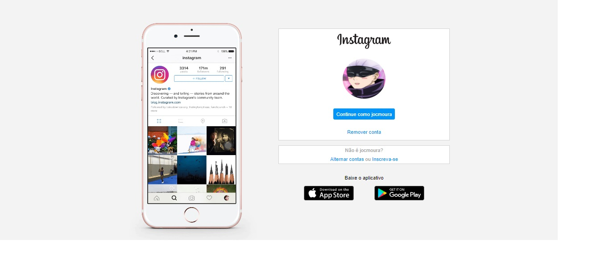
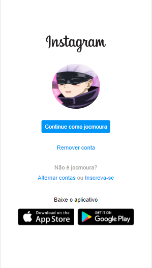

<h1 align="center"> DevLinks </h1>

  <a href="#-tecnologias">Tecnologias</a>&nbsp;&nbsp;&nbsp;|&nbsp;&nbsp;&nbsp;
  <a href="#-projeto">Projeto</a>&nbsp;&nbsp;&nbsp;|&nbsp;&nbsp;&nbsp;
  <a href="#-layout">Layout</a>&nbsp;&nbsp;&nbsp;|&nbsp;&nbsp;&nbsp;
  <a href="#memo-licença">Licença</a>

Imagem do projeto
  

 

  Imagem projeto mobile.

  

  

## Tecnologias

Esse projeto foi desenvolvido com as seguintes tecnologias:

- HTML e CSS
- Git e Github

## 💻 Projeto

- [Acesse o projeto finalizado, online](https://jocmoura.github.io/estudo-dio-pagina-login-insta/)

## :memo: Licença

Esse projeto está sob a licença MIT.

---

Feito por Jonas Moura - Estudo.

